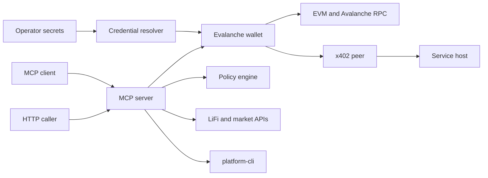

# Evalanche Adversarial Threat Model

## Executive summary

Evalanche is a TypeScript SDK and MCP server that can hold wallet credentials and execute high-impact on-chain actions across EVM, Avalanche P/X-chain, Polymarket, Hyperliquid, dYdX, bridge, swap, and x402 flows. This hardening pass addressed the highest-risk preconditions: HTTP MCP now requires bearer-token authentication, binds to loopback by default, and enforces request body limits; high-risk helper execution paths now run through the policy hook; policy removal requires explicit confirmation; and x402 service endpoints require a settlement verifier unless deliberately configured for signed-intent mode. Residual risk remains around trusted local MCP callers, external quote/API integrity, dependency reachability, and policy coverage for venue-specific off-chain order semantics.

## Scope and assumptions

In scope: runtime SDK and MCP server code under `src/`, package/CLI metadata in `package.json`, and security posture notes in `SECURITY.md` / `VULN_NOTES.md`.

Out of scope: `website/`, generated `website-dist/`, archived docs, release helper scripts, tests except as supporting evidence, and smart contract audits for `contracts/`.

Assumptions:

- The npm package may be embedded in local agents that load a funded private key, mnemonic, macOS Keychain secret, environment secret, or keystore.
- `evalanche-mcp` stdio is intended for trusted local MCP clients. HTTP mode now requires `EVALANCHE_MCP_HTTP_TOKEN` or `startHTTP({ authToken })`, and binds to `127.0.0.1` unless a caller opts into another host.
- Network attackers do not know wallet secrets directly. HTTP attackers also need the MCP bearer token unless another bug leaks or forwards it.
- External APIs such as Li.Fi, Polymarket, Hyperliquid, CoinGecko, RPC providers, and IPFS gateways are semi-trusted dependencies, not controlled by this repository.
- Severity assumes mainnet-capable wallets with non-trivial balances. Testnet-only usage lowers impact.

Open questions that would materially change risk ranking:

- Are MCP bearer tokens ever exposed to browser contexts, logs, or less-trusted local tools?
- Are MCP callers always mutually trusted, or can LLM/tool-routing output or other local users reach stdio/HTTP with the token?
- Which settlement verifier should production x402 service hosts use for each supported chain/currency?

## System model

### Primary components

- Public SDK API: `Evalanche` exports wallet boot/generation, identity, transactions, x402, bridge, swap, DeFi, prediction market, and perp clients from `src/index.ts`.
- Credential resolution: `resolveAgentSecrets` checks OpenClaw secret refs, raw env vars, macOS Keychain, then keystore fallback in `src/secrets.ts`.
- Wallet execution core: `Evalanche.send`, `Evalanche.call`, bridge/swap/perp/DeFi helpers sign transactions through an ethers wallet in `src/agent.ts`.
- MCP server: `EvalancheMCPServer` exposes wallet, bridge, swap, Polymarket, perp, policy, service, memory, and platform-cli tools over stdio or HTTP in `src/mcp/server.ts`.
- External integrations: Li.Fi, Gas.zip through Li.Fi, Polymarket CLOB/bridge/Gamma APIs, Hyperliquid, dYdX, CoinGecko, RPC providers, IPFS, and `platform-cli`.

### Data flows and trust boundaries

- Operator/environment -> credential resolver: private keys, mnemonics, secret refs, keychain entries, keystore files. Channel is process env, subprocess, Keychain CLI, and filesystem. There is no user auth boundary inside the package; process access is assumed trusted.
- MCP client -> MCP server: JSON-RPC messages over stdio or HTTP. Stdio inherits the parent process trust boundary. HTTP now requires a bearer token, defaults to loopback, rejects oversized bodies, and uses POST JSON parsing.
- MCP server -> wallet signer: tool arguments become signatures, native transfers, contract calls, token approvals, bridge/swap execution, Polymarket orders, and perp orders. Native send/call, generic approval/proxy helpers, Li.Fi bridge/swap, and Gas.zip execution now run through the active policy hook.
- SDK -> external APIs/RPCs: quote, route, orderbook, market, and registration metadata over HTTPS or JSON-RPC. `safeFetch` enforces HTTPS, timeout, redirect blocking, and response byte caps, with private-network blocking only when callers opt in.
- MCP server -> `platform-cli`: selected tool arguments become subprocess arguments via `execFile`, not shell interpolation. The subprocess inherits most environment variables and may receive wallet private key via env when configured.
- x402 client/service -> remote peer: a 402 challenge is converted into a signed JSON proof and replayed in an HTTP header. Service endpoints now require a settlement verifier by default; the prior signature-only behavior is available only through explicit `paymentMode: 'signed-intent'`.

#### Diagram

## Assets and security objectives

| Asset | Why it matters | Security objective (C/I/A) |
| --- | --- | --- |
| Private key / mnemonic / keystore entropy | Direct control of wallet funds and agent identity | C/I |
| Wallet balances and approvals | Loss of funds or persistent token-spender risk | I |
| Agent identity and reputation actions | On-chain identity, trust score, and service reputation can be manipulated | I |
| MCP tool surface | It can sign messages, execute transactions, trade, bridge, and call subprocesses | I/A |
| Spending policy state | Intended guardrail for automated spending | I |
| External route/order data | Drives transaction construction and market execution decisions | I/A |
| x402 service revenue records | Used to decide paid access and reported revenue | I |
| Dependency tree / npm package artifact | Users install and run wallet-capable code | I/C |

## Attacker model

### Capabilities

- Send JSON-RPC POSTs to the HTTP MCP server if reachable and the bearer token is known, leaked, or forwarded by a trusted local caller.
- Influence LLM/tool outputs or local automation that calls MCP tools.
- Control remote HTTPS endpoints used by `pay_and_fetch` or agent registration metadata.
- Return malicious or misleading data from compromised external quote/order/metadata APIs.
- Exhaust process CPU or worker availability by sending frequent HTTP MCP requests after authentication.

### Non-capabilities

- Read process memory, env vars, keychain, or filesystem secrets without another host compromise.
- Modify trusted npm package code after installation unless supply-chain compromise is in scope.
- Break HTTPS/TLS or sign blockchain transactions without access to the signer or a reachable signing oracle.
- Reach stdio MCP unless they control the parent MCP client/process.

## Entry points and attack surfaces

| Surface | How reached | Trust boundary | Notes | Evidence |
| --- | --- | --- | --- | --- |
| MCP stdio JSON-RPC | `evalanche-mcp` default | Parent process to server | Trusted local client assumption | `src/mcp/cli.ts` `main`, `src/mcp/server.ts` `startStdio` |
| MCP HTTP JSON-RPC | `EVALANCHE_MCP_HTTP_TOKEN=... evalanche-mcp --http --port 3402` | Token-bearing network caller to wallet-capable server | Requires bearer token, defaults to loopback, enforces request timeout and body limit | `src/mcp/cli.ts`, `src/mcp/server.ts` `startHTTP` |
| Wallet actions | MCP tools `send_avax`, `call_contract`, `sign_message` | JSON args to signer | Direct signing and transaction execution | `src/mcp/server.ts:2672`, `src/mcp/server.ts:2681`, `src/mcp/server.ts:2693` |
| Bridge/swap/gas funding | MCP tools `bridge_tokens`, `fund_destination_gas`, `lifi_swap`, `lifi_compose` | JSON args plus external quote API to signer | Execution uses quote-provided transaction request | `src/mcp/server.ts:2809`, `src/bridge/lifi.ts:318` |
| Generic approval/proxy helpers | MCP tools `approve_and_call`, `upgrade_proxy` | JSON args to arbitrary contract calls | Now calls policy authorization before executing helper transactions | `src/mcp/server.ts` |
| Policy control | MCP tool `set_policy` | JSON args to guardrail state | Removal requires `remove=true` and `confirm="remove"` | `src/mcp/server.ts` |
| x402 client/service | HTTP 402 challenge and `x-payment-proof` | Remote peer to signer/service | Settled endpoints require a settlement verifier; signed-intent mode is explicit | `src/x402/client.ts`, `src/economy/service.ts` |
| Platform CLI | MCP subnet/P-chain tools | JSON args to subprocess | `execFile` avoids shell injection, but operations are privileged | `src/avalanche/platform-cli.ts:178` |
| URL fetchers | `safeFetch` callers | Remote URL/API to parser | HTTPS enforced; private network block is opt-in | `src/utils/safe-fetch.ts` |

## Top abuse paths

1. Wallet drain through token-bearing HTTP MCP: attacker obtains the MCP bearer token or reaches a trusted local caller, calls `tools/call` with wallet execution tools, and the server signs transactions with the loaded wallet.
2. Signature oracle abuse: attacker with MCP access calls `sign_message` and reuses signatures for login, CLOB auth-like flows, or other off-chain authorization protocols that accept arbitrary wallet signatures.
3. Guardrail weakening: attacker with MCP access deliberately removes policy using the explicit removal confirmation or relies on policy gaps for token amounts and off-chain orders, then invokes high-impact tools.
4. Persistent token risk: attacker with MCP access calls approval, vault, swap, or bridge flows to create broad approvals or execute quote-provided calldata, leaving residual token-spender risk after the MCP server is stopped.
5. x402 settlement bypass by misconfiguration: an operator deploys paid endpoints without a production verifier or intentionally uses signed-intent mode for untrusted peers, allowing access without settled funds.
6. MCP HTTP DoS after authentication: attacker with the bearer token sends frequent requests; body size and timeout controls reduce memory risk, but there is no rate limit or concurrency cap yet.
7. External quote/API manipulation: compromised route/order API returns malicious transaction request or misleading market data; policy catches target/value constraints, but semantic quote invariants still need local validation.

## Threat model table

| Threat ID | Threat source | Prerequisites | Threat action | Impact | Impacted assets | Existing controls (evidence) | Gaps | Recommended mitigations | Detection ideas | Likelihood | Impact severity | Priority |
| --- | --- | --- | --- | --- | --- | --- | --- | --- | --- | --- | --- | --- |
| TM-001 | Remote or adjacent network attacker | MCP server is started with `--http`, reachable beyond trusted local clients, and the attacker has or obtains the bearer token. Wallet credentials are loaded. | Send JSON-RPC `tools/call` requests for signing, transfer, bridge, swap, approval, or trading tools. | Direct loss of funds, unauthorized orders, approvals, identity/reputation writes. | Wallet balances, approvals, identity, reputation. | HTTP requires bearer token, defaults to `127.0.0.1`, and has body limits (`src/mcp/server.ts` `startHTTP`); CLI requires `EVALANCHE_MCP_HTTP_TOKEN` (`src/mcp/cli.ts`). | Token leakage or overly broad host binding can still expose the wallet-powerful API; no per-tool auth tiers yet. | Add read-only vs signing scopes, rotateable token files with strict permissions, and optional mTLS for non-loopback use. | Log remote address, tool name, wallet address, tx hash; alert on non-loopback clients and signing tools. | Low to Medium | High | Medium |
| TM-002 | Malicious MCP caller or compromised LLM/tool routing | Attacker can call MCP tools through a trusted local channel or with the HTTP token. A spending policy is configured or expected. | Attempt to remove policy or call helper tools outside normal send/call wrappers. | Guardrail bypass or excessive approvals/spend if a path is not covered by policy semantics. | Policy state, wallet balances, approvals. | Policy removal now requires `remove=true` and `confirm="remove"`; `authorizeTransaction` covers generic approval/proxy, Li.Fi bridge/swap, and Gas.zip execution (`src/agent.ts`, `src/mcp/server.ts`, `src/bridge/gaszip.ts`). | Venue-specific off-chain order semantics and token-amount budgets are not fully represented by native-value policy fields. | Extend policy to token amounts, approval ceilings, typed-data/off-chain order limits, and tool scopes. | Emit structured policy change events; alert on policy removal, dry-run mode, max approvals, and transactions without a policy decision ID. | Medium | Medium to High | Medium |
| TM-003 | Any x402 service consumer | Service host is used to sell access to endpoints. A production settlement verifier is missing, incorrectly implemented, or endpoint is explicitly set to `signed-intent`. | Sign a proof declaring amount/currency/chain without matching settled funds. | Free service access and false revenue accounting. | Service revenue, access control, reputation. | Nonce, TTL, body hash, signature, amount, currency, chain checks exist; settled endpoints require a verifier before serving (`src/economy/service.ts`). | The repository provides the verifier hook, not a complete chain-specific verifier implementation. | Implement and test verifier adapters for supported settlement chains/tokens; reserve `signed-intent` for trusted peer tests and demos. | Log proof nonce, payer, settlement tx/facilitator receipt; alert on missing settlement or repeated unpaid proofs. | Low to Medium | Medium | Medium |
| TM-004 | Malicious or compromised external route/order API | Agent uses quote/order data from external APIs and signs returned transaction requests. | Return transaction request or market data that routes value/approvals unexpectedly or misprices execution. | Fund loss through malicious calldata, excess slippage, wrong recipient, or bad approvals. | Wallet balances, approvals, trade integrity. | HTTPS, redirect blocking, timeouts, byte caps (`src/utils/safe-fetch.ts`); Li.Fi/Gas.zip transaction requests now pass through policy authorization. | Policy authorization does not yet validate semantic quote invariants like token deltas, final recipient, or known router/spender sets. | Validate quote invariants locally before signing; require chain/provider match; maintain known router/spender allowlists; simulate transaction when possible. | Log route ID, tool, tx target, token deltas; alert on unknown spender/router or destination mismatch. | Low to Medium | High | Medium |
| TM-005 | Remote network attacker | HTTP MCP is reachable and attacker has or can send requests to the token-protected endpoint. | Stream oversized bodies or many requests. | Process memory/CPU exhaustion and agent unavailability. | MCP availability, wallet automation reliability. | POST-only, bearer auth, 10s request timeout, and max body bytes now exist (`src/mcp/server.ts` `startHTTP`). | No per-IP rate limit or concurrency cap yet. | Add rate limiting and concurrency limits for HTTP mode. | Track body sizes, parse failures, request duration, event loop delay, and per-IP rates. | Low | Medium | Low |
| TM-006 | Supply-chain or dependency attacker | Users install package with vulnerable transitive dependencies. | Exploit reachable dependency vulnerability or compromise install/runtime package path. | Wallet compromise, code execution, or data exfiltration depending on reachability. | Wallet secrets, package integrity. | `VULN_NOTES.md` tracks audit snapshot and overrides; package provenance is enabled in `package.json`. | Current note reports `5 critical`, `3 high`, `12 low` audit findings, but reachability is unresolved. | Run reachability triage for runtime imports, remove unused heavy integrations from default path, keep overrides pinned, and gate release on reachable high/critical findings. | CI audit with allowlist expiry; alert on dependency graph changes in wallet/runtime paths. | Medium | Medium to High | Medium |

## Criticality calibration

- Critical: private key/mnemonic disclosure; dependency RCE in a default-loaded wallet path; authenticated remote access to wallet signing with no effective policy on a funded mainnet wallet.
- High: trusted caller can execute transactions, create broad approvals, or cause paid-service authorization bypass; compromised quote source can cause unbounded fund movement where policy is absent or permissive.
- Medium: denial of service against local agent automation; external metadata manipulation that does not directly sign transactions; dependency vulnerabilities with unclear runtime reachability.
- Low: read-only metadata exposure, test-only issues, docs drift, or issues requiring local process compromise that already implies wallet compromise.

## Focus paths for security review

| Path | Why it matters | Related Threat IDs |
| --- | --- | --- |
| `src/mcp/server.ts` | Central JSON-RPC dispatcher, HTTP transport, wallet-capable tool surface, and policy mutations. | TM-001, TM-002, TM-005 |
| `src/mcp/cli.ts` | Defines HTTP mode and credential-loading CLI behavior. | TM-001 |
| `src/agent.ts` | Policy enforcement and wallet execution orchestration live here. | TM-002, TM-004 |
| `src/economy/policies.ts` | Budget/allowlist semantics and gaps for token approvals/off-chain orders. | TM-002 |
| `src/utils/contract-helpers.ts` | Generic approval and proxy upgrade helpers with arbitrary targets. | TM-001, TM-002 |
| `src/bridge/lifi.ts` | Signs external quote-provided transaction requests. | TM-004 |
| `src/bridge/gaszip.ts` | Gas funding execution path through external quote data. | TM-004 |
| `src/swap/arena.ts` | Direct token approval and swap execution outside `Evalanche.call`. | TM-002 |
| `src/swap/yak.ts` | Direct max approval and router execution path. | TM-002 |
| `src/defi/vaults.ts` | Approves vaults with `MaxUint256` and deposits directly. | TM-002 |
| `src/x402/client.ts` | Creates and sends payment proofs. | TM-003 |
| `src/x402/facilitator.ts` | Signs payment proof payloads. | TM-003 |
| `src/economy/service.ts` | Verifies proofs, requires settlement verification by default, and preserves explicit signed-intent mode. | TM-003 |
| `src/utils/safe-fetch.ts` | Common URL-fetch control point for SSRF, redirects, timeouts, and response caps. | TM-004 |
| `src/avalanche/platform-cli.ts` | Subprocess execution boundary for privileged Avalanche operations. | TM-001, TM-002 |
| `package.json` and `VULN_NOTES.md` | Dependency and release posture for wallet-capable package. | TM-006 |

## Quality check

- Covered discovered runtime entry points: SDK API, MCP stdio, MCP HTTP, x402, external API fetches, platform-cli subprocesses, and credential resolution.
- Covered trust boundaries in threats: network-to-MCP, MCP-to-signer, MCP-to-policy, SDK-to-external APIs, x402 peer-to-service, and package-to-dependency tree.
- Separated runtime from CI/dev: release scripts, website, and tests are out of scope except where they document posture.
- User clarifications: none provided yet; token handling, caller trust, and production x402 verifier choice remain explicit assumptions.
- Graph orientation: local code-review graph built successfully for 142 files / 1,698 nodes / 13,883 edges on branch `main`.
